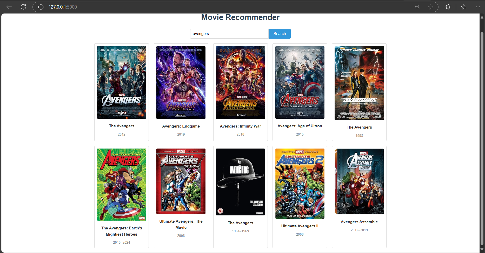
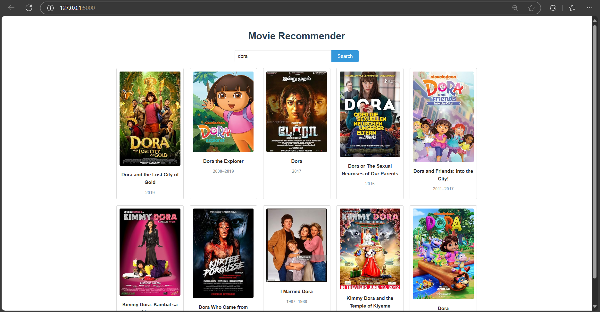
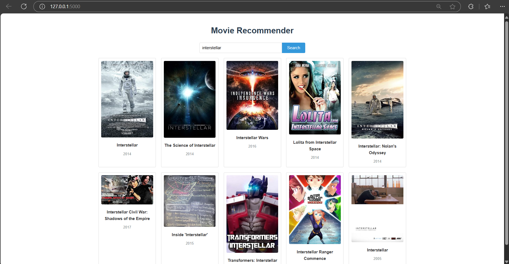

# Movie-Recommender

## Overview
This project is a movie recommendation system that uses a content-based filtering approach. The system suggests movies to users based on their preferences and past interactions. A simple GUI provides an intuitive interface for users to interact with the model.

## Features
- **Content-Based Recommendation**: Utilizes movie metadata to recommend similar movies.
- **Interactive GUI**: Allows users to input their favorite movies and receive personalized recommendations.
- **Visual Elements**: Includes sample movie posters to enhance user experience.

## Project Structure
- **`movierecomen.py`**: Core Python script that contains the recommendation logic and integrates the GUI.
- **Datasets**:
  - `tmdb_5000_credits.csv`
  - `tmdb_5000_movies.csv`
  These files contain metadata used for building the recommendation model.
- **Templates**:
  - The `templates/` folder includes HTML files for the GUI layout.
- **Images**:
  - Movie posters such as `avengers.png`, `dora.png`, `fight club.png`, `interstellar.png`, and `shaolin soccer.png` are used in the GUI.

## How It Works
1. The model processes movie data to calculate similarity scores between movies based on features like genre, cast, and crew.
2. Users input a movie title through the GUI.
3. The system suggests similar movies and displays their posters if available.

## Getting Started

### Prerequisites
Ensure you have the following installed:
- Python 3.x
- Required libraries (install via `pip install -r requirements.txt` if a `requirements.txt` file is provided).

### Running the Application
1. Navigate to the project directory.
   ```bash
   cd Movie-Recommender-main
   ```
2. Run the main script.
   ```bash
   python movierecomen.py
   ```
3. Open the provided URL in your browser to access the GUI.

## Sample Outputs
Below are some sample movie posters used in the project:
- 
- 
- 
- 
- 
---
Feel free to modify and enhance this project as needed!
